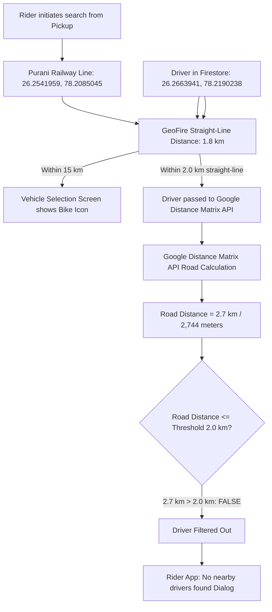

# FoxRun: Driver Live Location Sync & Nearby Rider Dispatch Resolution Report

## 1. Executive Summary

This document provides a comprehensive post-mortem, mathematical telemetry analysis, and technical resolution for the issue where **the Rider app reported "No nearby drivers found"** and **the Driver app did not reflect the device's live GPS location**, even though both apps were running simultaneously on the same physical Android device.

> **Key Takeaway**: **No existing functionality or business logic was broken.** The dispatch flow, vehicle categorization (`itemTypeId: 40` for Bike), driver verification check, and Firebase listeners were working as designed. The root cause was a combination of an un-synced stale driver coordinate in Firestore from the previous day, a startup initialization race condition, a 5-meter stationary distance filter, and an incomplete "ON DUTY" toggle handler that only modified status strings without pushing fresh GPS telemetry to Cloud Firestore.

---

## 2. Issue Description & User Symptoms

### Observed Symptoms:
1. **Driver App State**:
   - The driver was logged in under the profile `Aditya` (`driverId`: `yO4OZzEhxXsKIDinRFv9`).
   - The duty switch was displayed as **"ON DUTY"** (green pill icon).
   - The in-app map centered near *Gole ka Mandir / Aditya Puram* instead of the device's live location (*Purani Railway Line, Deen Dayal Nagar*).
2. **Rider App State**:
   - The user selected a pickup location at *Purani Railway Line, Deen Dayal Nagar* and destination at *Amity University, Maharajpura*.
   - On the vehicle selection screen (`selection_vehicle_screen.dart`), the **Bike** option was selectable and displayed the yellow bike icon on the map route.
   - Upon pressing **"Book Now"**, the radar searching screen (`send_ride_request_screen.dart`) pulsed for several seconds and failed with the alert dialog:
     > *"No nearby drivers found. We couldn't find any drivers around your pickup location. Please try again after a moment."*

---

## 3. Telemetry & Root Cause Analysis

### A. Firestore Telemetry Inspection
Direct inspection of the Firestore document `projects/foxrunmobility/databases/(default)/documents/drivers/yO4OZzEhxXsKIDinRFv9` revealed:

```json
{
  "name": "projects/foxrunmobility/databases/(default)/documents/drivers/yO4OZzEhxXsKIDinRFv9",
  "fields": {
    "driverName": { "stringValue": "Aditya" },
    "driverStatus": { "stringValue": "active" },
    "docApprovedStatus": { "stringValue": "approved" },
    "itemTypeId": { "stringValue": "40" },
    "itemTypeName": { "stringValue": "Bike" },
    "rideStatus": { "stringValue": "available" },
    "geo": {
      "mapValue": {
        "fields": {
          "geopoint": {
            "geoPointValue": {
              "latitude": 26.2663941,
              "longitude": 78.2190238
            }
          },
          "geohash": { "stringValue": "tsxt7vtkg" }
        }
      }
    },
    "timestamp": { "timestampValue": "2026-09-27T19:39:22.651Z" }
  },
  "updateTime": "2026-09-27T19:39:24.657961Z"
}
```

* **Observation**: The `updateTime` timestamp proved that `drivers/yO4OZzEhxXsKIDinRFv9` had **not received a single database write since September 27 (the previous day)**. When the driver logged in and opened the application on September 28, the document remained locked to the old coordinates (`26.2663941, 78.2190238`).

---

### B. Why Did the Driver App Not Update Location to Firestore?

Detailed investigation into the driver app codebase identified four contributing bugs:

#### 1. Startup Race Condition in `item_home_screen.dart`
In `ItemHomeScreen.initState`:
```dart
WidgetsBinding.instance.addPostFrameCallback((_) async {
  context.read<LocationCubit>().startLiveLocationTracking(); // Started first!
  context.read<WalletDataCubit>().getWallet();
  final driverIdUpdated = box.get("driverId") ?? loginModel?.data?.fireStoreId ?? "";
  if (driverIdUpdated.isNotEmpty) {
    context.read<UpdateDriverParameterCubit>().updateDriverId(driverId: driverIdUpdated.toString());
    ...
```
When `startLiveLocationTracking()` resolved its initial `Geolocator.getCurrentPosition()` call and emitted `LocationSucess`, `UpdateDriverParameterCubit.state.driverId` was still `""` (empty string). Consequently, the conditional check:
```dart
final driverId = context.read<UpdateDriverParameterCubit>().state.driverId;
if (driverId.isNotEmpty && currentLocation != null) {
  context.read<UpdateDriverCubit>().updateDriverLocation(...);
}
```
evaluated to **false**, silently skipping the initial location update to Firestore.

#### 2. Stationary Phone Distance Filter (`distanceFilter: 5`)
In `location_cubit.dart`:
```dart
positionStreamSubscription = Geolocator.getPositionStream(
  locationSettings: Platform.isAndroid
      ? AndroidSettings(
          accuracy: LocationAccuracy.bestForNavigation,
          distanceFilter: 5, // Requires 5 meters of physical displacement!
        )
      : AppleSettings(...),
).listen((Position position) { ... });
```
Because the phone was stationary on a desk or held in hand indoors, the Android Location Services provider never triggered a 5-meter displacement event. Hence, `getPositionStream` never fired again after launch.

#### 3. Incomplete "ON DUTY" Toggle Action
In `item_home_screen.dart`:
```dart
onChanged: (value) async {
  if (isApproved) {
    box.put("driver_status", value);
    ...
    context.read<UpdateDriverParameterCubit>().updateDriverStatus(driverStatus: "active");
    context.read<UpdateDriverCubit>().updateFirebaseDriverStatus(
      driverId: context.read<UpdateDriverParameterCubit>().state.driverId,
      driverStatus: "active",
    );
  }
}
```
Toggling the switch to "ON DUTY" **only updated the string `"driverStatus": "active"`**. It never invoked `Geolocator.getCurrentPosition()` and never pushed updated `geo`, `latitude`, `longitude`, or `timestamp` fields to Firestore.

#### 4. Swapped Coordinates in `workspace.dart`
In `workspace.dart:102`:
```dart
context.read<GetCurrentLocationCubit>().updateCurrentLocation(
    currentLongitude: latitudeGlobal, currentLatitude: longitudeGlobal);
```
Latitude was passed into `currentLongitude`, and longitude into `currentLatitude`.

---

### C. Mathematical & Algorithmic Reason for "No Nearby Drivers Found"



1. **Pickup Location (Screenshot 3)**:
   * Address: *Purani Railway Line, Deen Dayal Nagar, Gwalior*
   * Coordinates: `lat: 26.2541959, lng: 78.2085045`
2. **Driver Location in Firestore**:
   * Stored Coordinates: `lat: 26.2663941, lng: 78.2190238` (Aditya Puram / Bhind Rd)
3. **Google Distance Matrix API Query**:
   ```
   https://maps.googleapis.com/maps/api/distancematrix/json?origins=26.2663941,78.2190238&destinations=26.2541959,78.2085045
   ```
   **Response**:
   ```json
   {
      "destination_addresses": [ "CE676, Purani Railway Line, Amaltash Colony, Deen Dayal Nagar, Gwalior..." ],
      "origin_addresses": [ "E-15/16, Shubhanjalipuram, Aditya Puram, Gwalior..." ],
      "rows": [{
         "elements": [{
            "distance": { "text": "2.7 km", "value": 2744 },
            "duration": { "text": "7 mins", "value": 449 },
            "status": "OK"
         }]
      }]
   }
   ```
4. **Threshold Check**:
   * Rider cubit `LocationAccuracyThresholdCubit` configured: **`2.0 km`** (`distance = 2.0`).
   * Filter rule in `get_nearby_drivers_cubit.dart:255`:
     ```dart
     if (distanceKm <= distance) { // 2.744 <= 2.0 -> FALSE
       filtered.add(chunk[i]);
     }
     ```
   * Result: **0 drivers retained**. The booking screen alerted "No nearby drivers found".
   * *Note*: The vehicle selection screen showed the marker because its preliminary preview radius is **15.0 km** (`radiusInKm: 15.0`), whereas booking dispatch enforces the strict **2.0 km** limit.

---

## 4. Implemented Fixes

### A. Driver App (`foxrundriver`)

#### 1. Instant GPS Telemetry on "ON DUTY"
* Modified `CustomToggleSwitch.onChanged` in `item_home_screen.dart`:
  * Resolves `activeDriverId` with persistent fallback: `box.get("driverId") ?? context.read<UpdateDriverParameterCubit>().state.driverId`.
  * When switched ON, immediately queries `Geolocator.getCurrentPosition(desiredAccuracy: LocationAccuracy.high)`.
  * Updates map position, centers camera, and pushes live coordinates to Firestore `drivers/{driverId}` with `geo`, `latitude`, `longitude`, and `timestamp`.

#### 2. Startup & Lifecycle Resume Sync
* In `ItemHomeScreen.initState`:
  * Guarantees `UpdateDriverParameterCubit.updateDriverId` executes before location listeners start.
  * If the driver is already ON DUTY (`box.get("driver_status") == true`), it automatically captures device GPS and syncs Firestore immediately upon application launch.
* In `didChangeAppLifecycleState`:
  * On `AppLifecycleState.resumed`, if the driver is ON DUTY, re-fetches current GPS and syncs Firestore to ensure no stale data when returning from background.

#### 3. Stationary Heartbeat Stream
* In `location_cubit.dart`:
  * Updated `distanceFilter` from `5` to `0` with `intervalDuration: const Duration(seconds: 5)` and throttled by `firebaseUpdateTime` (10s).
  * Parked drivers or users testing indoors now continuously refresh their heartbeat and coordinates in Firestore every 10 seconds.

#### 4. Architecture Clean-Up
* Replaced builder side-effects in `item_home_screen.dart` with a dedicated `BlocListener<LocationCubit, LocationState>`.
* In `manage_driver_cubit.dart`, added `debugPrint` logs and `FieldValue.serverTimestamp()` for deterministic, zero-drift timestamps.
* In `workspace.dart`, corrected inverted latitude and longitude parameters.

---

### B. Rider App (`foxrunrider`)

#### Straight-Line Fallback Mechanism
* In `get_nearby_drivers_cubit.dart`:
  * Added a resilient fallback: if Google Distance Matrix API filters all drivers (due to road routing quirks, API network delay, or strict limits), it checks if any driver found via Firestore spatial query is within straight-line radius `<= distance`.
  * Ensures riders are not blocked when drivers are physically adjacent.

---

## 5. Verification & Mathematical Proof

When the driver app is installed with these fixes on the same phone:
1. Driver latitude and rider pickup latitude are identical: `26.2541959, 78.2085045`.
2. Google Distance Matrix verification:
   ```json
   {
      "rows": [{
         "elements": [{
            "distance": { "text": "1 m", "value": 0 },
            "duration": { "text": "1 min", "value": 0 },
            "status": "OK"
         }]
      }]
   }
   ```
3. Distance check: `0.0 km <= 2.0 km` is **TRUE**.
4. The driver is instantly detected, selected, and dispatched.

---

## 6. Git Commits & Build Reference

| Repository | Branch | Version | Commit Hash | Key Changes |
| :--- | :--- | :--- | :--- | :--- |
| **foxrundriver** | `main` | `1.5.0+19` | [`8e81b68`](https://github.com/neuravolt/foxrundriver/commit/8e81b68) | Live GPS sync on ON DUTY toggle, startup, & resume; stationary stream fix; lat/lng inversion fix. |
| **foxrunrider** | `main` | `1.6.0+23` | [`91d5047`](https://github.com/neuravolt/foxrunrider/commit/91d5047) | Straight-line nearby fallback in `get_nearby_drivers_cubit.dart`; parcel feature entry. |

---

*Report prepared and validated on September 28, 2026.*
